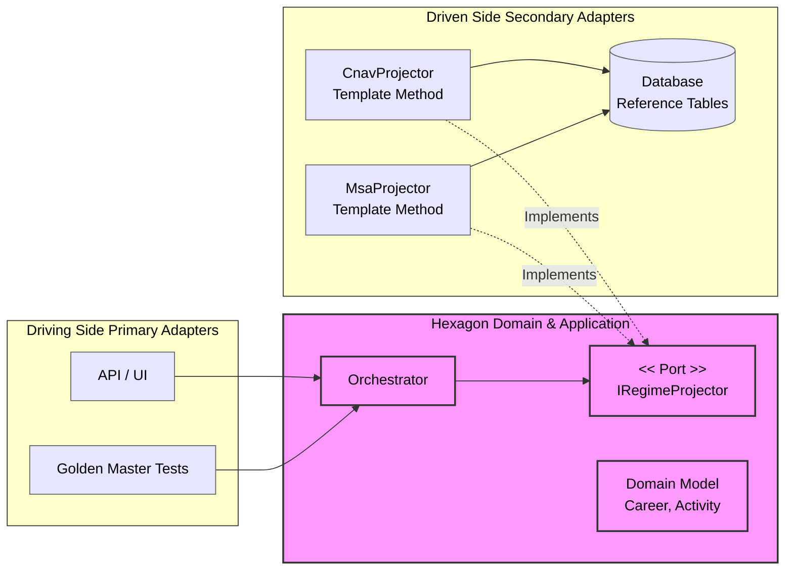

## The "God Class" Must Die

If you’ve ever worked in the pension industry, you know the feeling. You open a solution, look for the calculation logic, and find yourself staring into the abyss: a 15,000-line procedural monster full of nested `if/else` statements trying to handle 40 years of legislative changes.

When we started designing the new projection engine for a national-scale system, we faced a brutal reality. The complexity wasn't just "high"; it was combinatorial.

$$
\text{Pain Level} \approx (\text{42 Regimes}) \times (\text{Dozens of Career Events}) \times (\text{40 Years of Projection})
$$

We have the CNAV (private sector), Agirc-Arrco (complementary), MSA (farmers)... each with its own vocabulary, its own math, and its own exceptions. A standard layered architecture wasn't going to cut it. We didn't just need "clean code"; we needed a survival strategy.

Here is how we moved from a fragile monolith to a battle-hardened **Hexagonal Architecture**.

---

### 1. The Domain: Stop Coding, Start Listening

The mistake we made in the legacy system was treating the pension rules as just "data processing."

We paused everything and went back to the whiteboard with the actuaries. We realized our "Ubiquitous Language" was broken. We were talking about *Services* and *Managers*; they were talking about *Projectors* and *Regimes*.

We reframed the entire problem around two concepts:

1. **The Invariant (Time):** Whether you are a farmer or a CEO, a career projection is *always* a loop from today until retirement. That never changes.
2. **The Variant (The Law):** *How* you accrue rights inside that loop changes completely depending on the regime.

This distinction was our "Eureka" moment. It meant we could isolate the **Time Loop** (the engine) from the **Legal Rules** (the plugins).

---

### 2. The Architecture: Building a Blast Shield

We chose **Hexagonal Architecture (Ports & Adapters)**. Not because it’s trendy, but because we needed a quarantine zone.

We needed to be able to say: *"Inside this hexagon, the database does not exist. The legacy API does not exist. Only the math exists."*

Here is what our mental model looks like. Notice how everything points *inward*. The Domain is king, and the database is just a detail we deal with later.



---

### 3. The Controversial Choice: Inheritance over Composition

I can hear the purists screaming already: *"Favor Composition over Inheritance!"*

Usually, I agree. But in this specific domain, we made a conscious choice to use the **Template Method Pattern**.

Why? Because the "Annual Loop" isn't just a behavior; it's a **Legal Invariant**. We couldn't risk a developer implementing a new Regime (say, for Lawyers) and "forgetting" to apply the inflation rate or skipping a year.

We locked the loop in a `base class`. It handles the plumbing. The concrete classes only handle the business rules.

**The Base Class (The Enforcer):**

```csharp
public abstract class BaseRegimeSalaireProjector<TData> : RegimeProjectorBase<InputSalarie, TData>
{
    public override IReadOnlyCollection<Activity> Project(InputSalarie input, Context context)
    {
        var activities = new List<Activity>();
        var salary = input.BaseSalary;

        // We enforce the loop here. 
        // No junior dev can accidentally break the space-time continuum.
        foreach (var period in context.ProjectionPeriod.SplitByYear()) 
        {
            salary = salary.ApplyInflation(context.Rate);
            
            // This is the only part the concrete class is allowed to touch:
            TData rights = CalculateRights(period, salary); 
            
            activities.Add(new SalariedActivity(period, rights));
        }
        return activities;
    }

    protected abstract TData CalculateRights(Year year, Money salary);
}
```

**The Concrete Class (The Business Logic):**
This is where the CNAV complexity lives. It’s clean, focused, and testable.

```csharp
public sealed class CnavSalaireProjector : BaseRegimeSalaireProjector<CnavData>
{
    protected override CnavData CalculateRights(Year year, Money salary)
    {
        // Pure business logic. No loop, no infrastructure.
        var limit = _cnavReferential.GetCeiling(year);
        var quarters = _cnavCalculator.ComputeQuarters(salary, limit);
        return new CnavData(quarters);
    }
}
```

---

### 4. Performance: Don't Load the World

Architecture is great, but if it takes 5 seconds to load, users will hate it.

With 42 regimes, we couldn't just "Load All Data". If a user has only worked in the private sector, loading the rules for Civil Servants is a waste of memory.

We implemented a **Dynamic Loader**. The Orchestrator looks at the user's career, identifies the relevant regimes, and injects *only* the necessary Adapters and Reference Tables. It keeps the memory footprint low and the startup time fast.

---

### 5. The Honest Trade-offs

Let's be real: this architecture isn't free. It came with its own set of headaches.

**1. Why not a Rule Engine?**
We debated this for weeks. "Why not use a Rule Engine like Drools?"
Because French pension rules are temporally coupled (*a decision in 1990 affects 2024*). Implementing that in a rule engine meant creating a custom DSL. Debugging a DSL at 3 AM is my definition of hell. We stuck to C# because type safety is the best documentation we have.

**2. The "File Explosion"**
We went from one giant file to hundreds of small classes. For a new joiner, it’s intimidating. You can't just "scroll down" to read the logic anymore; you have to navigate the object graph. We had to invest heavily in onboarding and diagrams to help people find their way.

**3. Complexity has to go somewhere**
We didn't destroy the complexity; we just moved it. The complexity used to be in the `if` statements; now it's in the **Wiring** (Dependency Injection). If the DI container is misconfigured, the whole thing blows up. We had to write unit tests *for our DI container* to sleep at night.

---

### Conclusion: It's About Sanity, Not Just Code

Transitioning to Hexagonal Architecture and DDD didn't magically simplify the French pension system. The laws are still complicated.

But what it gave us was **predictability**.

Today, when the government passes a new reform for the MSA regime, we don't sweat. We create a new `MsaProjector2025`, plug it into the hexagon, and we know—we *know*—that we haven't broken the CNAV calculation.

In a system this complex, that peace of mind is worth every extra class file.
