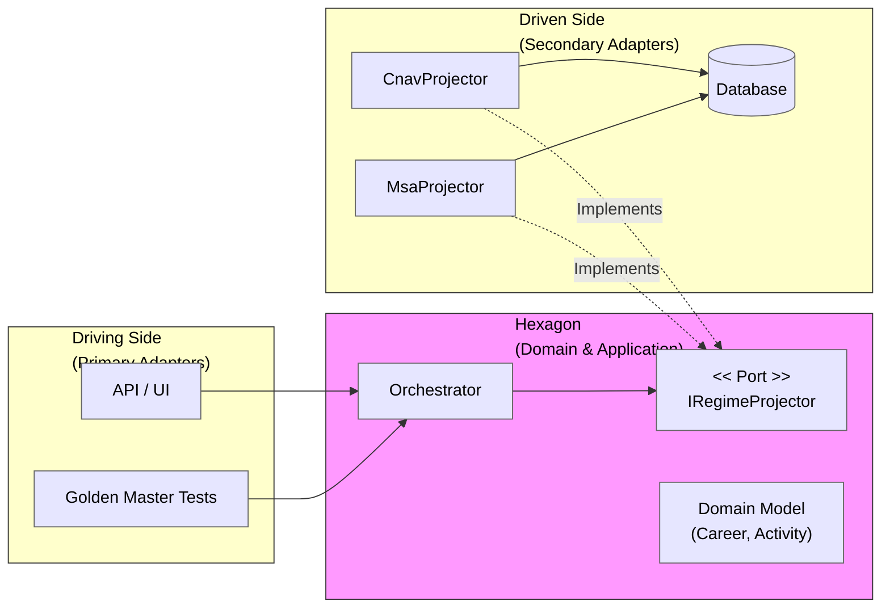

## The Engineering Challenge: Absorbing Legal Entropy

In the pension industry, complexity isn't just a hurdle; it’s the domain itself. When designing a national-scale projection engine, we aren't just writing code; we are modeling a massive **structural challenge**.

We can visualize the "Complexity Space" of the system as:

$$
\text{Complexity} \approx (\text{HypothesisTypes}) \times (\text{ContributedRegimes}) \times (\text{ProjectionYears})
$$

With 42+ distinct regimes (CNAV, Agirc-Arrco, MSA...), dozens of career scenarios, and 40-year projections, a standard imperative approach—nested `if/else` logic—fails to scale. The complexity grows multiplicatively. This is how we transitioned from a monolithic procedural engine to a **Hexagonal Architecture** powered by **DDD**.

---

### 1. Domain Analysis: Ubiquitous Language as a Compass

The legacy system suffered from an "Anemic Domain Model"—logic was a thin layer scattered across UI and Services. We reframed the problem using **Domain-Driven Design**:

* **The Invariant (Time):** Regardless of the regime, a projection is a temporal loop iterating from `CurrentYear` to `RetirementYear`.
* **The Variant (Law):** The rules for acquiring rights change per regime (Quarters for CNAV, Points for Agirc-Arrco).
* **The Aggregates:** `CareerProjection` acts as the Aggregate Root, ensuring consistency between `Activities` (Value Objects).

> **A Note on Ubiquitous Language:**
> In our context, **"Projector"** is a core domain concept defined by business experts. It’s not a technical read-model (CQRS); it is the actuarial engine responsible for forecasting rights over time.

---

### 2. Architecture: Building the Blast Shield

We adopted a strict **Hexagonal Architecture** (Ports & Adapters) to isolate the Domain. We don't see layers; we see a **Driving Side** (Tests, API) and a **Driven Side** (Infrastructure, Databases).

#### The Interface (The Port)
Every regime logic must satisfy this contract. Note that `RegimeId` is not a primitive string but a **Smart Enum / Value Object** to avoid primitive obsession and encapsulate regime metadata.

```csharp
// The Port (Domain Boundary)
public interface IRegimeProjector
{
    RegimeId Id { get; } // Smart Enum / Value Object
    IReadOnlyCollection<Activity> Project(InputSalarie input, Context context);
}
```

#### Visualizing the Hexagon



#### The Core Pattern: Template Method for Temporal Loops
To avoid duplicating the "Time Loop" across 42 regimes, we factorized the invariant mechanics into a **Domain Service**.

```csharp
// The Domain Service Base: Manages the Invariant (Time)
public abstract class BaseRegimeSalaireProjector<TData> : IRegimeProjector
{
    public abstract RegimeId Id { get; }

    public IReadOnlyCollection<Activity> Project(InputSalarie input, Context context)
    {
        var activities = new List<Activity>();
        var salary = input.BaseSalary;

        foreach (var period in context.ProjectionPeriod.SplitByYear()) 
        {
            salary = salary.ApplyInflation(context.Rate);
            
            // The Business Rule Hook (Variant)
            TData rights = CalculateRights(period, salary); 
            
            activities.Add(new SalariedActivity(period, rights));
        }
        return activities;
    }

    protected abstract TData CalculateRights(Year year, Money salary);
}
```

---

### 3. High-Performance Orchestration

Architecture must serve performance. In a modular monolith, loading data for 42 regimes when a user only contributed to 2 is a performance sin.

#### The Loader Pattern
We use a specific Port to identify and fetch only the required legal data.

```csharp
// The Port for optimized data loading
public interface IRegimeLoader
{
    IReadOnlyCollection<RegimeId> GetRequiredRegimes(CareerHistory history);
    Task LoadReferenceDataAsync(IEnumerable<RegimeId> regimeIds);
}
```

#### The Orchestrator
The Orchestrator coordinates the workflow without knowing the details of the laws.

```csharp
// Application Layer: The Orchestrator
public class CalculationOrchestrator
{
    private readonly IEnumerable<IRegimeProjector> _projectors;
    private readonly IRegimeLoader _loader;

    public async Task<CareerProjection> ExecuteAsync(UserContext user)
    {
        // 1. Identify and Pre-load only required data
        var requiredIds = _loader.GetRequiredRegimes(user.Career);
        await _loader.LoadReferenceDataAsync(requiredIds);
        
        // 2. Polymorphic execution
        var allActivities = _projectors
            .Where(p => requiredIds.Contains(p.Id))
            .SelectMany(p => p.Project(user.Input, user.Context))
            .ToList();

        return new CareerProjection(allActivities);
    }
}
```

---

### 4. Trade-offs: The Architect's "No Free Lunch"

#### 1. Why not a Rule Engine?
A common critique. But French pensions involve deep temporal dependencies. A DSL would have become as complex as C# itself. We chose a strongly typed **Strategy pattern** over a "black box" engine for better debugging and maintainability.

#### 2. The "Inheritance vs Composition" Controversy
Purists argue against Base Classes. We accepted this coupling **deliberately**. The "Annual Loop" is a **Legal Invariant**. By enforcing it via Inheritance, we prevent developers from accidentally deviating from regulatory standards. We traded flexibility for **Compliance Safety**.

#### 3. Fragmentation vs. Simplicity
Moving from a script to a decoupled architecture increases "file explosion." Logic is now spread across Base Classes, Ports, and Adapters. Understanding the "whole picture" requires navigating the class hierarchy, which we mitigated with exhaustive documentation.

---

### 5. Ensuring Correctness: The Safety Net

With great abstraction comes great responsibility. To ensure non-regression, we use:
* **Golden Master Testing:** Comparing JSON outputs against legacy systems to guarantee parity to the cent.
* **Property-Based Testing:** Ensuring invariants (e.g., max 4 quarters/year) are never violated by any combination of rules.

---

### Conclusion

Hexagonal Architecture isn't just about "Clean Code"—it's a mechanism for **absorbing legal entropy**. It allowed us to isolate business complexity, scale development across teams, and optimize performance by loading only what matters. In regulated domains, your architecture is your best defense against the chaos of evolving laws.