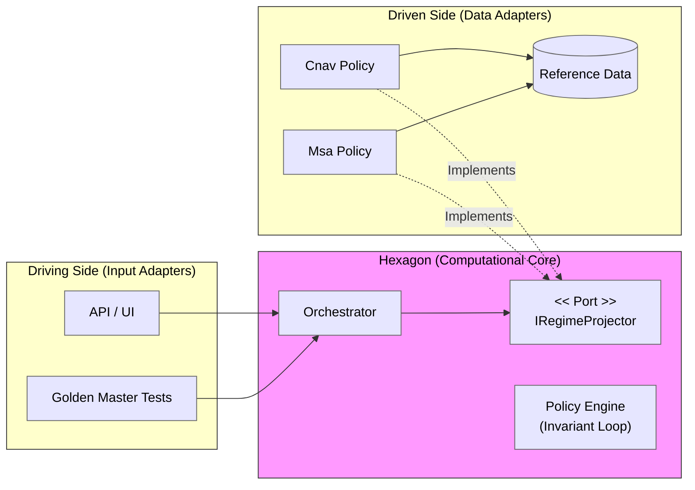
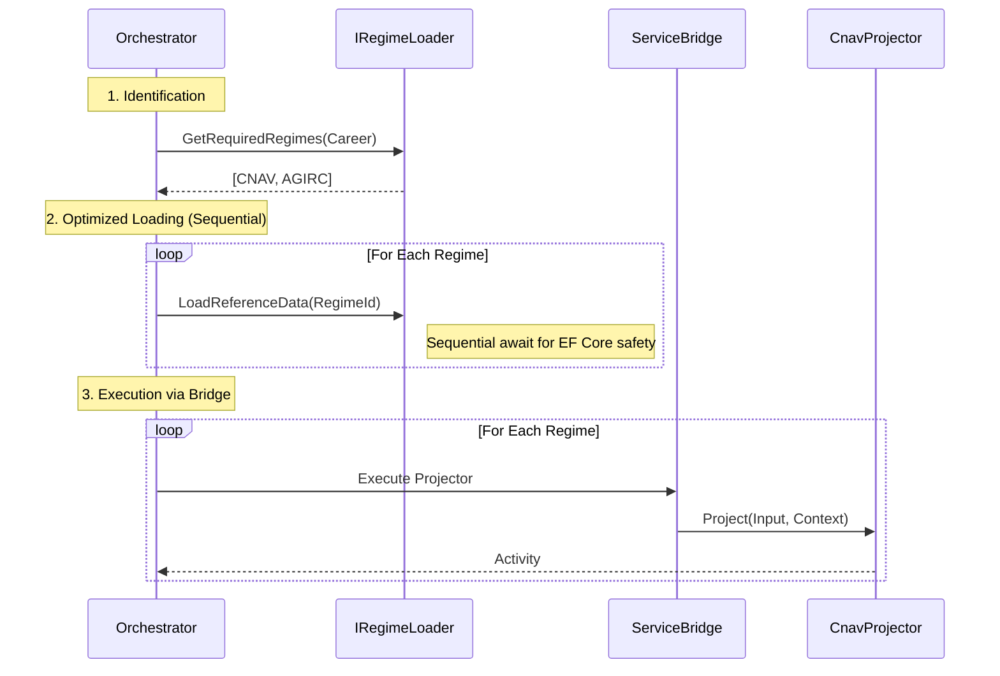

## The Structural Problem: Combinatorial Entropy

In the domain of national pension projections, complexity is not an implementation detail; it is the primary characteristic of the system. We are not building a standard behavioral model with rich state transitions; we are engineering a **Policy Engine** capable of forecasting rights over 40 years across a fractured legislative landscape.

The architectural challenge can be formalized as a combinatorial explosion:

$$
\text{System Entropy} \approx (\text{Career Hypothesis}) \times (\text{42 Independent Regimes}) \times (\text{Temporal Evolution})
$$

A standard layered architecture fails here because the **rate of legislative change** exceeds the **maintainability threshold** of a monolithic model.

This article details the architectural strategy used to decouple the **Invariant (Time)** from the **Variant (Law)**, moving from a procedural script to a modular **Computational Core**.

---

### 1. Domain Analysis: Strategic DDD as a Discovery Tool

We utilized Domain-Driven Design (DDD) primarily for **Strategic Design**—to identify Bounded Contexts—rather than for tactical "Rich Entity" modeling.

We identified that the engine is **Two-Dimensional**:

1. **The Temporal Model (The Strategy):** Defined by the Career Hypothesis (e.g., *Salaried*, *Unemployment*, *Expatriation*). This dictates the "shape" of the timeline.
2. **The Legal Policy (The Projector):** Defined by the Regime (e.g., *CNAV*, *AGIRC*). This dictates the "math" applied within that timeline.

> **Architectural Decision:** We reframed the system from a "Simulation Service" to a **Federation of Projectors** orchestrated by **Hypothesis Strategies**.

---

### 2. The Architecture: Isolation for Testability

We adopted **Hexagonal Architecture (Ports & Adapters)**. The primary driver was not just database decoupling, but **Testability**. We needed the ability to run the "Core Policies" in a vacuum—without the noise of the database or the API—to verify complex actuarial scenarios against a Golden Master.

#### Visualizing the Hexagon

Notice how the *Orchestrator* coordinates the flow without knowing the specific regime rules.



---

### 3. Implementation: Modeling the Invariant

To enforce the **Temporal Backbone**, we chose **Inheritance (Template Method)** over Composition. 

**The Governance Trade-off:**
In a standard domain model, invariants should be enforced by the model itself, not by class hierarchy. However, in this regulated context, the projection loop is a **Framework Concern**. By embedding it in a `BaseRegimeProjector`, we treat it as "Domain Infrastructure," ensuring that individual Policy implementations focus solely on arithmetic, without the ability to corrupt the timeline.

```csharp
// The Framework Layer: Manages the Invariant
public abstract class BaseRegimeSalaireProjector<TData> : IRegimeProjector
{
    public abstract RegimeId Id { get; }

    public IReadOnlyCollection<Activity> Project(InputSalarie input, Context context)
    {
        var activities = new List<Activity>();
        var salary = input.BaseSalary;

        // The Invariant Loop: Enforced by the framework
        foreach (var period in context.ProjectionPeriod.SplitByYear()) 
        {
            salary = salary.ApplyInflation(context.Rate);
            
            // The Variant Hook: Where the Law is applied
            TData rights = CalculateRights(period, salary); 
            
            activities.Add(new SalariedActivity(period, rights));
        }
        return activities;
    }

    protected abstract TData CalculateRights(Year year, Money salary);
}
```

---

### 4. Orchestration: Solving Real-World Friction

The complexity of the system is not just in the calculation, but in the **wiring** between the abstract Core and the concrete Infrastructure.

#### The Dynamic Sequence (Performance)

The Orchestrator delegates to a `Loader` port to fetch *only* the legislative parameters required for the user's specific career history (O(1) filtering).



#### Language Friction: The "Bridge Tax" & Governance

Implementing this in C# required accepting **Accidental Complexity**. Since our Projectors are generic (`<TData>`), we faced covariance issues when injecting them into a unified collection. We introduced a **Bridge Pattern** to adapt specific inputs to the generic engine. 

While this adds verbosity, it provides **Governance via Compilation**: it becomes physically impossible for a developer to pass "Unemployment Data" to a "Salaried Projector." The compiler enforces the boundary between Hypotheses.

---

### 5. Business Impact: The Ultimate Test of Reversibility

The true validation of software architecture is not how fast you can build, but how safely you can change direction. We experienced this during the **Pension Reform of 2023** and its subsequent **Suspension in late 2025**.

#### Phase 1: The Reform (2023)

The government shifted the legal Age of Departure.

* **Legacy Impact:** This would have required a risky rewrite of the main procedural loop, affecting all 42 regimes simultaneously.
* **Architecture Response:** We implemented a `Strategy2023` for the specific CNAV Projector. The core loop (`BaseProjector`) remained untouched. **Time-to-market: 2 days.**

#### Phase 2: The Suspension (Dec 2025)

Two years later, political shifts led to the suspension of key parts of the reform.

* **Legacy Impact:** Unpicking "spaghetti code" logic intertwined with two years of subsequent patches. A nightmare scenario often leading to "frozen" releases.
* **Architecture Response:** Because the 2023 logic was an isolated Policy Strategy, we simply reverted the Orchestrator configuration to prioritize the previous strategy. **Time-to-market: 2 hours.**

**Conclusion:** The architecture provided **Reversibility**. In a volatile legislative environment, the ability to *undo* complexity is just as valuable as the ability to handle it.

---

### Final Thoughts

This architecture is not a silver bullet. It introduces fragmentation and requires managing language friction (generics/covariance). However, for a regulated **Policy Engine**, it provides the necessary isolation to turn **Legislative Volatility** into a manageable software process.
